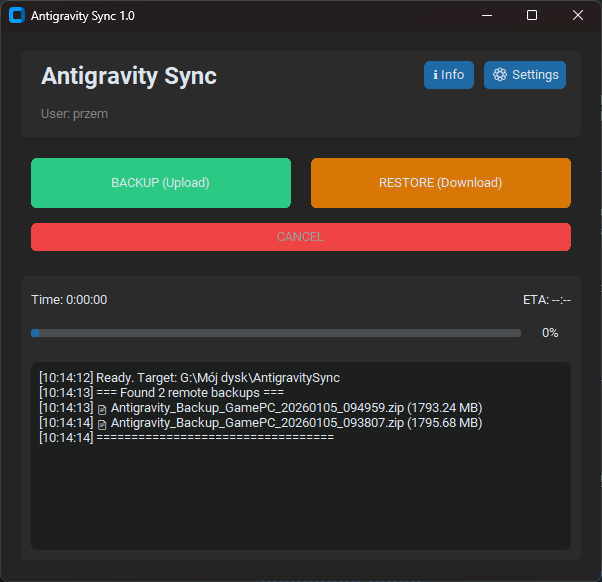

# Antigravity Sync - 1.0 (05-01-2026)

**Antigravity Sync** is a robust, user-friendly backup automation tool designed to synchronize your local development projects with Google Drive. Built with Python and CustomTkinter, it offers a modern GUI, background scheduling, and smart retention policies.



## 🚀 Features

*   **Bidirectional Sync**:
    *   **Backup**: Compresses selected local folders into a ZIP archive and uploads them to Google Drive (simulated via local Drive client path).
    *   **Restore**: Downloads and extracts the latest backup from Google Drive, with smart conflict detection and "Permission Denied" handling.
*   **Modern GUI**: A clean, dark-themed interface built with `customtkinter`.
*   **Background Operation**:
    *   **System Tray**: Minimizes to the system tray to run unobtrusively in the background.
    *   **Scheduler**: Set specific times (HH:MM) for automatic daily backups.
*   **Smart Management**:
    *   **Retention Policy**: Automatically deletes old backups, keeping only the latest $N$ archives (configurable, max 7).
    *   **Filtering**: Advanced `.gitignore`-style pattern matching to exclude files like `.git`, `__pycache__`, `*.tmp`, `node_modules`, etc.
*   **Resiliency**:
    *   Gracefully handles locked files during restore.
    *   Thread-safe operations with progress bars, elapsed time tracking, and ETA capabilities.

## 📦 Installation & Usage

### Option 1: Standalone Executable (Recommended)
Simply download and run `AntigravitySync.exe`. No Python installation is required.

### Option 2: Running from Source
1.  **Clone the repository**:
    ```bash
    git clone https://github.com/YourUsername/Antigravity_sync.git
    cd Antigravity_sync
    ```
2.  **Install dependencies**:
    ```bash
    pip install customtkinter pystray Pillow
    ```
3.  **Run the application**:
    ```bash
    python sync_app.py
    ```

## ⚙️ Configuration

The application creates a `sync_config.json` file automatically. You can modify settings via the **Settings (⚙)** button in the app:

*   **Google Drive Path**: Path to your local Google Drive sync folder (e.g., `G:\My Drive\AntigravitySync`).
*   **Target Folders**: Comma-separated list of folders (relative to your User Home) to back up (e.g., `.gemini, .antigravity`).
*   **Ignored Patterns**: Files or folders to skip (e.g., `__pycache__, *.log, desktop.ini`).
*   **Scheduled Times**: Times to trigger auto-backup (e.g., `09:00, 14:00, 18:00`).
*   **Retention Count**: Number of recent backups to keep (1-7).

## 🛠 Building the Executable

To compile the application yourself using PyInstaller:

```bash
python -m PyInstaller --noconsole --onefile --name="AntigravitySync" --collect-all customtkinter sync_app.py
```

## 📝 Changelog

**v1.0 (Initial Release) - 05/01/2026**
*   GUI Implementation (CustomTkinter)
*   Bidirectional Sync (Backup & Restore)
*   System Tray & Scheduler Support
*   Smart Restore with progress visualization
